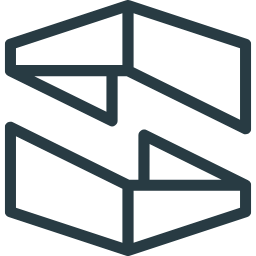

<h1 align="center"></h1>
<h2 align="center">Stackery for VSCode</h2>

  
  
  

Stackery extension for Visual Studio Code. Provides local template and visual editing for serverless applications built using Stackery.

## Installation

1. Open the extension palette (`Cmd+Shift+X` or `Ctrl+Shift+X`)
2. Search for, and select __Stackery for VSCode__
3. Select __Install__

## Usage

The Stackery extension allows you to visualize and configure the AWS resources defined in your `template.yaml` file. Configuring a resource using the Stackery visual editor renders the appropriate YAML in the `template.yaml` file, and

### Visual Editing

Two ways to start using the Stackery visual editor to configure your stack resources:

1. Right-click on `template.yaml` to access the context menu, and select __Open in Stackery__

    

    __Or__

2. While in the `template.yaml` file, select the Stackery logo on the top-right corner of the window

    

### Configure resources

To configure stack resources:

1. Select `Add Resource` in the top-right corner of the visual editor
2. Choose from a list of available resources
3. Drag (or double-click) a resource onto the visual editor
4. Double-click the resource to open its configuration panel

> For details on configurable properties of each resource, visit the <a href="https://docs.stackery.io/docs/api/nodes/Function/" target="_blank" alt="">Stackery Cloud Resources Reference</a>

### Event subscription

Subscribe compute resources to events emitted by other resources using a __event subscription wire__ (solid wire), e.g. an __Edge Function__ triggered by a __CDN__ lifecycle event.

### Service discovery

Connect a compute resource (Function, Edge Function, or Docker Task) to another resource using a __service discovery wire__ (dashed wire) to populate the IAM policies and environment variables required for it to interact with that resource, e.g. a __Function__ accessing an __Object Store__.

### Stackery Actions/Options/Buttons?

{ Buttons within the visual editor to prepare/deploy/build stacks? Still in progress. }

The Stackery extension provides the following keyboard shortcuts:

__`Cmd+Shift+D`__: Initiate a stack deployment by preparing and executing a changeset in CloudFormation

__`Cmd+Shift+B`__: Initiates a ...

__`Cmd+Shift+D`__: Initiates a ...

## Releases

See `CHANGELOG.MD`.
